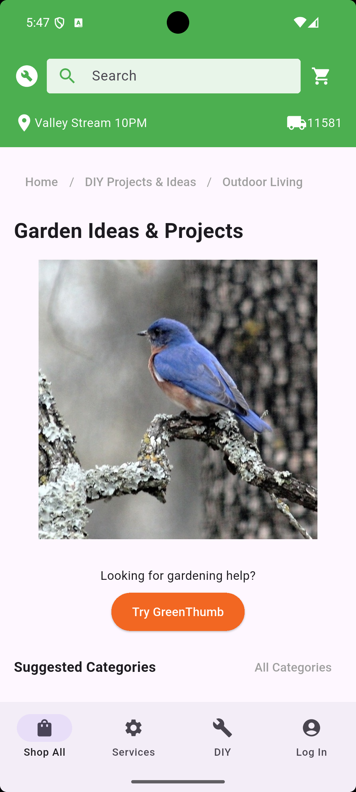
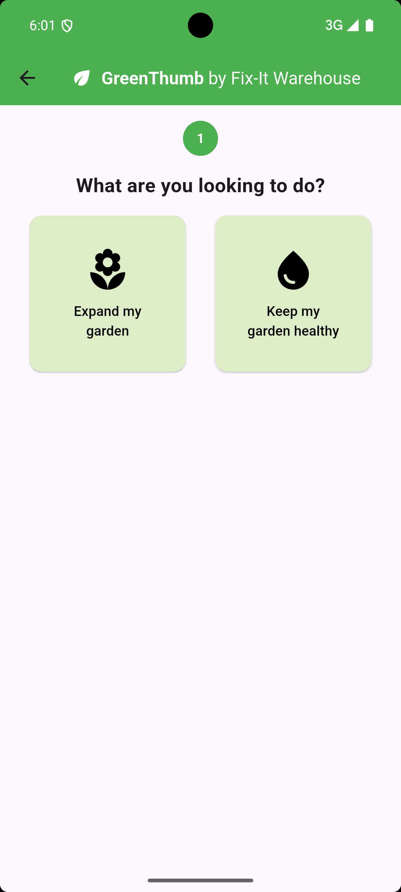
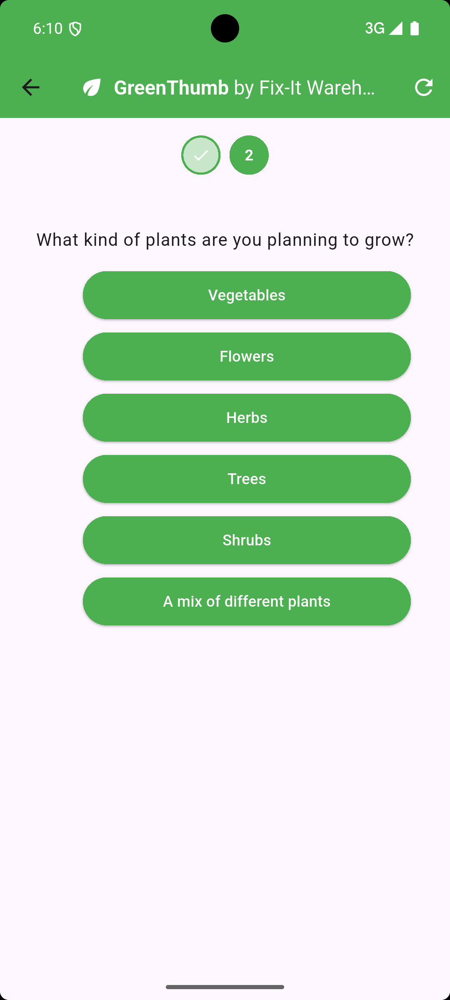
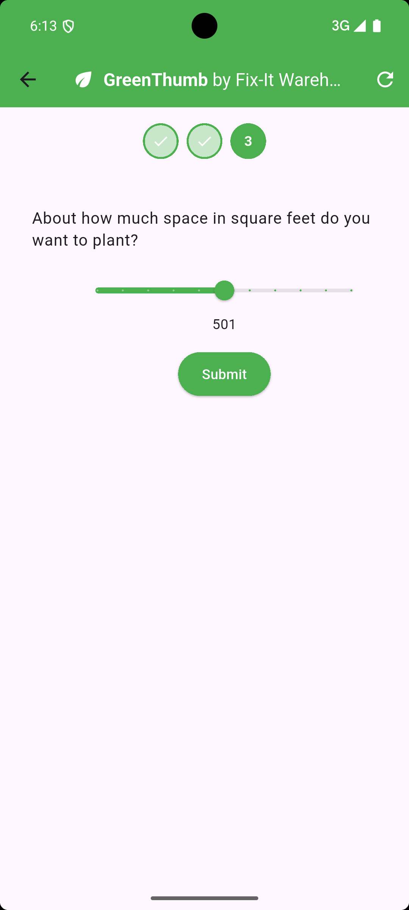
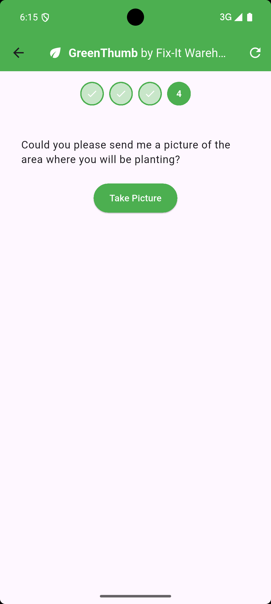

# Flutter Fix-in Warehouse

The Flutter Fix-in Warehouse sample demonstrates using Flutter and Genkit
together to build a generative AI with the following features:
- server-side tool calls
- server-to-client tool calls (aka Genkit interrupts)
- Retrieve Augmented Generation (aka RAG)
- tested on macOS, web, Android and iOS

# Client

The sample app itself is the client and server-side for a big box store called
"Fix-it Warehouse." The client-side app is written in Flutter and starts by
showing the Gardening Ideas & Products page of the store as if the user had
navigated there from an imaginary home page:



This page contains the entry point to our generative AI agent, code-named
"Green Thumb" and is activated with the orange button.

## Q&A

The user is then lead through a series of pages where they're asked questions
about a plant-related activity that they'd like to perform in their garden. The
initial page asks them what kind of activity they'd like to undertake:



This choice is built into the app and you can see the details in the
`user_prompt_picker.dart` file. However, after this, the LLM on the server takes
over and begins asking the user a series of clarifying questions.

## Human In The Loop
The way that the LLM can ask the user questions is using a set of tools at it's
disposal called "interrupts." These days, Most generative AI SDKs have the
ability to add tools to enable the LLM to get data that you'd rather it not
guess about, like the current weather. However, those tools are typically
handled in the same process as the LLM is being invoked from. In our case, we're
using Genkit on the server, so a traditional tool would need to be invoked from
the server.

However, what we want is to enable the LLM to call from the server process back
to the client with a question, for the client to gather the answer form the user
of the app and then to send that answer back to the server so that it can
continue with whatever it was doing before it interrupted itself to get the user
involved in the first place. Hence the name: interrupt.

There are three kinds of interrupts that this sample supports: choice, range and
image.

## Choice Picker

The LLM can form a question and give the user a set of choices, which is shown
to the user via the widget defined in the `interrupt_choice_picker.dart` file:



The Flutter app has no idea what the LLM is going to ask; it simply shows the
question, provides a button for each of the possible answers that the LLM
specifies and sends back the choice the user makes.

## Range Picker

The LLM can also ask for a number in a range:



Again, the question, min and max values are specified by the LLM; the Flutter
app simply shows the slide widget with the appropriate mix and max, and sends
the choice back to the server. The details on in the
`interrupt_range_picker.dart` file.

## Image Picker

And finally, the LLM can ask the user to take a picture:



The LLM specifies the type of picture it would like the user to provide and the
Flutter app allows the user to use their camera or upload from their gallery
depending on the device on which it's running. You can see how it does that in
the `interrupt_image_picker.dart` file.

## LLM Reponse

Once the LLM has gathered the additional information it needs, it forms a
recommendation, including looking up any useful products from the product
database on the server using another tool that performs an embedding-based
search using Genkit helpers.


The final response comes back as simple Markdown, which is displayed for the
user in `model_response_view.dart`.

## Client Flow

The client flow is orchestrated by the widget in `wizard_page.dart`, which
coordinates between the user's initial prompt, sending data back to the
server to resume an interrupt tool and choosing which pages to show based on the
messages it's receiving from the LLM.

The most important part of this orchestation is mapping the kind of message
received from the server to the apppropriate page in the wizard to display next:

```dart
class _WizardPageState extends State<WizardPage> {
  final _service = GreenthumbService();

  ...

  Widget _buildStepView(Message message, bool isCurrentStep) {
    // don't allow the user to form a request if we're already handling one
    final onRequest = isCurrentStep ? _onRequest : null;

    // don't allow the user to create a response if the tool already has one
    final isToolResponse =
        message is InterruptMessage && message.toolResponse != null;
    final onResume = isCurrentStep && !isToolResponse ? _onResume : null;

    return switch (message) {
      // gather initial user prompt
      UserRequest() => UserPromptPicker(message: message, onRequest: onRequest),

      // display final model response
      ModelResponse() => ModelResponseView(message: message),

      // Handle interrupt tools
      InterruptMessage() => switch (message.toolRequest!.name) {
        'choice' => InterruptChoicePicker(message: message, onResume: onResume),
        'image' => InterruptImagePicker(message: message, onResume: onResume),
        'range' => InterruptRangeValuePicker(
          message: message,
          onResume: onResume,
        ),
        _ => throw Exception('Unknown tool: ${message.toolRequest!.name}'),
      },
    };
  }

  void _onRequest(String prompt) => _service.request(prompt);

  void _onResume({String? ref, required String name, required String output}) =>
      _service.resume(ref: ref, name: name, output: output);
}
```

The `GreenthumbService` handles posting messages to the server and creating
messages as appropriate for data that the LLM returns. Each message is mapped
to the appropriate widget, e.g. a `UserRequest` message maps to the initial
`UserPromptPicker` page and the final `ModelResponse` message maps to the
`ModelResponseView` page.

The most interesting part of this mapping is how the appropriate picker widget is
choosen based on the tool request name of the `InterruptMessage` message, i.e.
choice, range or image. These are the same names that the LLM uses on the server
and provides the connective tissue between the client and server to match a
interrupt request to an interrupt response.

# Server

The Fix-in Warehouse server is built using the Node.js SDK for Genkit and
contained in the `index.ts` file. It exports two Genkit flow endpoints, one to
handle GreenThumb requests from the Flutter app and one to index the product
database. The app uses the former and you can see how to use the latter yourself
in the Setup section below.

The 

# Setup

```sh
npm install
```

TODO: changing the endpoint address in the Flutter app

## Usage

```sh
export GOOGLE_GENAI_API_KEY=...
npm run dev
```

## Config
Index the products:
- create a new GCP project, e.g. my-gcp-proj
- Enable the Vertex AI API by visiting https://console.developers.google.com/apis/api/aiplatform.googleapis.com/overview?project=my-gcp-proj
- set the GCP project via `gcloud auth application-default set-quota-project fixit-warehouse`

- npm run index-products
- rm __db_products.json to reset embeddings
- 